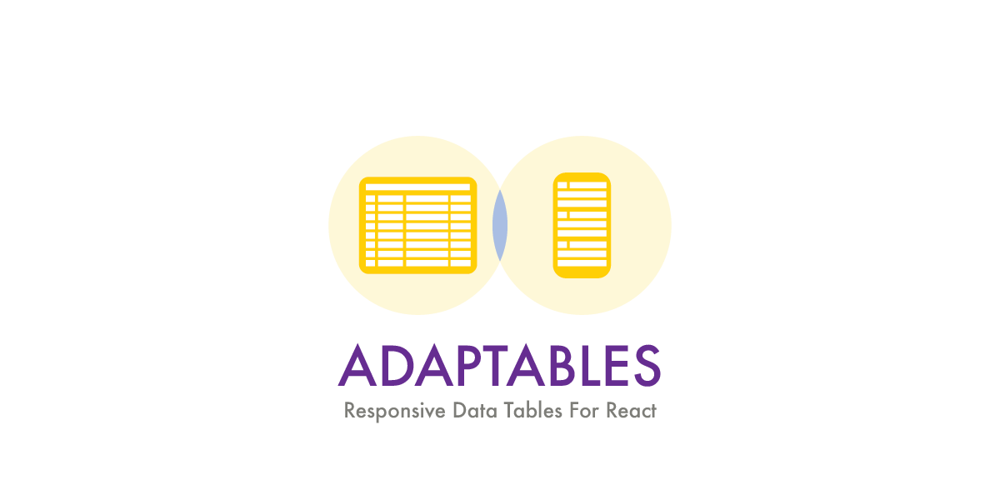
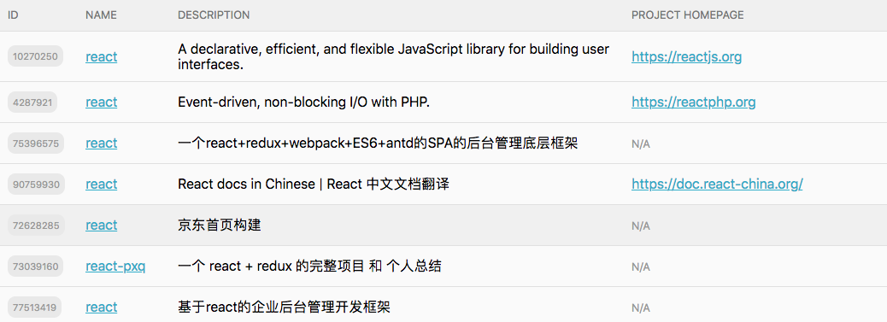
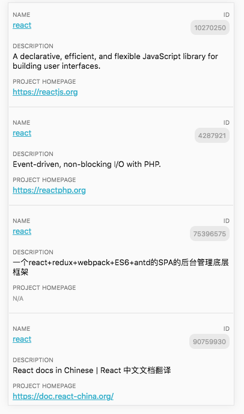

# Adaptables

This is a simple React component to create data tables that adapt gracefully to a mobile-layout.

[Click here for a simple demo](http://soska.github.io/adaptables/docs/index.html)




## How to use

Just pass a string to the name property to the `Unavatar` component and it will display a nice circular avatar with the name initials and a color chosen from a predefined palette.

```javascript
import Adaptable from 'adaptables';

class App extends React.Component {
  render() {
    return (
      <div>
        <Adaptable items={items} cells={cells} />
      </div>
    );
  }
}
```

## Installation

```
$ yarn add adaptables

or

$ npm install --save adaptables
```
